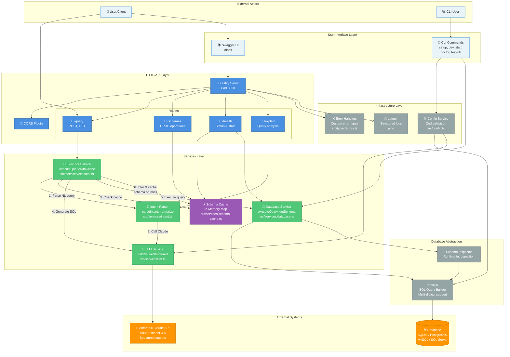
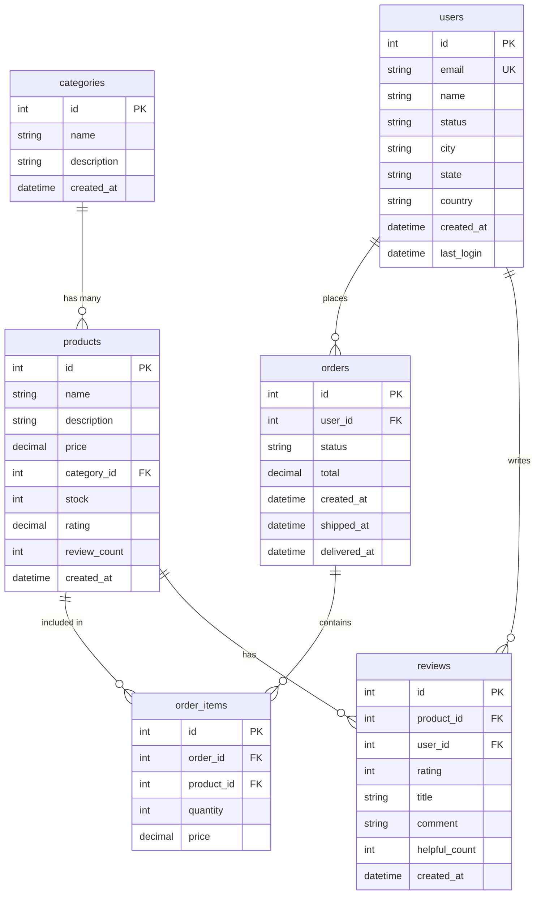

# NTTP Architecture Overview

## Introduction

NTTP (Natural Text Transfer Protocol) is a TypeScript-based API server that bridges natural language and SQL databases using AI. It provides a layered architecture that separates concerns between HTTP handling, business logic, AI integration, and data persistence.

## Architecture Principles

- **Layered Architecture** - Clear separation between API, services, and infrastructure
- **Multi-Database Support** - Single unified interface for SQLite, PostgreSQL, MySQL, and SQL Server
- **AI-Powered Query Translation** - Natural language → Intent → SQL using Claude AI
- **Performance Optimization** - Intelligent schema caching reduces LLM API calls
- **Type Safety** - Full TypeScript with runtime Zod validation
- **Safety First** - Read-only query validation prevents destructive operations

## System Architecture



### Legend

- 🔵 **Blue**: HTTP/API Layer - Request handling and routing
- 🟢 **Green**: Services Layer - Business logic and orchestration
- 🟠 **Orange**: External Systems - Third-party APIs and databases
- 🟣 **Purple**: Cache Layer - Performance optimization
- ⚫ **Grey**: Infrastructure - Configuration, logging, utilities
- ⚪ **Light Blue**: User Interface - User-facing components

## Component Details

### Layer 1: User Interface

**Swagger UI** (`/docs`)
- Interactive API documentation
- Try-it-now functionality
- Auto-generated from route definitions

**CLI Commands** (`bin/nttp.js`, `src/cli/*.ts`)
- `setup` - Interactive configuration wizard with database seeding
- `dev` - Development server with hot reload (tsx watch)
- `start` - Production server
- `doctor` - Health diagnostics and troubleshooting
- `test-db` - Database connection testing

### Layer 2: HTTP/API Layer

**Fastify Server** (`src/index.ts`)
- High-performance async web framework
- Plugin architecture (CORS, Swagger)
- Global error handling
- Lifecycle hooks for database initialization

**Routes** (`src/routes/`)
- **query.ts** - Main query execution (`POST /query`, `GET /query?q=...`)
- **schemas.ts** - Schema cache management (list, get, delete, pin/unpin)
- **utility.ts** - Health checks, intent listing, query explanation
- All routes use Zod validation for request/response

### Layer 3: Services Layer

**Executor Service** (`src/services/executor.ts`)
- **Central orchestration hub** for query processing
- `executeQueryWithCache()` - Main entry point
- `generateSql()` - Convert intent to SQL using LLM
- `validateSqlSafety()` - Block UPDATE/DELETE/DROP operations
- `inferSchemaFromResults()` - Auto-generate JSON schema from results

**Intent Parser** (`src/services/intent.ts`)
- `parseIntent()` - Natural language → structured Intent object
- `normalizeIntentDict()` - Canonicalize for cache key generation
- `generateSchemaId()` - SHA256 hash (first 16 chars)
- Extracts: entity, operation, filters, limit, fields, sort

**LLM Service** (`src/services/llm.ts`)
- `callClaudeStructured()` - Claude API with guaranteed JSON schema compliance
- Uses Anthropic SDK with structured outputs beta
- Exponential backoff retry (3 attempts)
- Token usage tracking

**Database Service** (`src/services/database.ts`)
- `initDb()` - Initialize Knex connection and cache schema
- `executeQuery()` - Execute SELECT with cross-dialect result normalization
- `executeWrite()` - Execute INSERT/UPDATE/DELETE
- `getAllTables()` - List tables via schema inspector
- `getTableSchema()` - Get column metadata
- `getSchemaDescription()` - Format schema for LLM prompts

**Schema Cache** (`src/services/schema-cache.ts`)
- In-memory Map storage (no persistence)
- Pin/unpin schemas to control eviction
- Track usage statistics (use_count, last_used_at)
- Store example queries (last 10)
- Cache statistics API

### Layer 4: Infrastructure

**Config Service** (`src/config.ts`)
- Load environment variables from `.env`
- Zod schema validation
- Build Knex configuration based on database type
- Validate API keys and connection strings

**Logger** (pino + pino-pretty)
- Structured JSON logging
- Pretty formatting for development
- Configurable log levels (INFO, DEBUG, WARN, ERROR)

**Error Handlers** (`src/types/errors.ts`)
- Custom error classes: IntentParseError, SQLGenerationError, SQLExecutionError, LLMError, CacheError
- Global Fastify error handler
- Proper HTTP status codes

### Layer 5: External Systems

**Anthropic Claude API**
- Model: claude-sonnet-4-5-20250929
- Structured outputs with JSON schema validation
- Used for: Intent parsing, SQL generation
- Configurable via `ANTHROPIC_API_KEY`

**Database**
- **SQLite** (better-sqlite3) - Default, file-based
- **PostgreSQL** (pg) - Connection pooling: 2-10
- **MySQL** (mysql2) - Connection pooling: 2-10
- **SQL Server** (mssql) - Connection pooling: 2-10
- Abstracted via Knex.js for dialect-agnostic queries

## Data Flow Walkthrough

### Query Execution Pipeline

Here's what happens when a user asks "show me active users":

1. **HTTP Request**
   ```
   POST /query
   { "query": "show me active users" }
   ```

2. **Route Handler** (`src/routes/query.ts`)
   - Validates request with Zod schema
   - Calls `Executor.executeQueryWithCache()`

3. **Intent Parsing** (`src/services/intent.ts`)
   - `parseIntent()` sends query to Claude API
   - Returns structured intent:
     ```typescript
     {
       entity: "users",
       operation: "select",
       filters: { status: "active" },
       limit: null,
       fields: ["*"],
       sort: null
     }
     ```

4. **Schema ID Generation**
   - `normalizeIntentDict()` canonicalizes intent
   - `generateSchemaId()` creates SHA256 hash (16 chars)
   - Example: `7a3f9e2c1b8d4a6f`

5. **Cache Lookup** (`src/services/schema-cache.ts`)
   - Check in-memory Map for schema ID
   - **Cache HIT** → Use cached schema (~50ms total)
   - **Cache MISS** → Continue to SQL generation

6. **SQL Generation** (`src/services/executor.ts`)
   - `generateSql()` calls Claude with intent + schema description
   - Returns parameterized SQL:
     ```sql
     SELECT * FROM users WHERE status = ? LIMIT 100
     ```
   - Parameters: `["active"]`

7. **SQL Safety Validation**
   - `validateSqlSafety()` checks for dangerous operations
   - Must start with SELECT/WITH
   - Blocks UPDATE/DELETE/DROP/ALTER/etc.

8. **Query Execution** (`src/services/database.ts`)
   - `executeQuery()` runs SQL via Knex
   - Normalizes results across database dialects
   - Returns: `[{ id: 1, email: "...", status: "active" }, ...]`

9. **Schema Inference** (on cache miss only)
   - `inferSchemaFromResults()` analyzes result structure
   - Generates JSON Schema from field types
   - Example:
     ```json
     {
       "type": "object",
       "properties": {
         "id": { "type": "integer" },
         "email": { "type": "string" },
         "status": { "type": "string" }
       }
     }
     ```

10. **Cache Update** (on cache miss)
    - Store schema with metadata in cache
    - Track example query
    - Set initial use_count = 1

11. **Response**
    ```json
    {
      "data": [...],
      "schema_id": "7a3f9e2c1b8d4a6f",
      "cache_hit": false,
      "execution_time_ms": 2341,
      "generated_sql": "SELECT * FROM users WHERE status = ? LIMIT 100"
    }
    ```

### Server Initialization Flow

1. **Start Command** - `npm run dev` or `npm start`
2. **Load Config** - `src/config.ts` reads `.env` and validates with Zod
3. **Create Fastify Instance** - `src/index.ts`
4. **Register Plugins** - CORS, Swagger, Swagger UI
5. **Register Routes** - query, schemas, utility
6. **onReady Hook** - `initDb()` initializes database connection
7. **Test Connection** - `SELECT 1` query to verify connectivity
8. **Build Schema Cache** - Cache all table schemas for fast lookup
9. **Listen** - Server starts on configured port (default: 8000)
10. **Ready** - Log startup message with available endpoints

## Database Schema

The system includes a sample e-commerce database schema:



**Seeding Options**:
- **Small**: 100 users, 50 products, 200 orders, 150 reviews (~1MB)
- **Full**: 10k users, 5k products, 50k orders, 25k reviews (~60MB)

## Performance Characteristics

### Response Times

- **Cache Hit**: <50ms
  - Schema already known
  - Skip intent parsing and SQL generation
  - Direct query execution

- **Cache Miss**: ~2-3 seconds
  - Intent parsing: ~500ms (LLM call)
  - SQL generation: ~800ms (LLM call)
  - Query execution: ~50ms
  - Schema inference: ~100ms
  - Cache storage: ~10ms

### Throughput

- **Cached Queries**: >10,000 requests/second
- **Uncached Queries**: ~5 requests/second (LLM API rate limits)

### Cache Efficiency

- After warm-up, cache hit rate typically >90%
- Similar queries share schemas (e.g., "active users" and "show active users")
- Schema pinning prevents eviction for critical queries

## Key Design Decisions

### Why Knex.js?
- **Multi-database support** with single API
- **Dialect-aware parameter binding** prevents SQL injection
- **Schema inspection** for runtime introspection
- **Connection pooling** for optimal performance

### Why Claude Structured Outputs?
- **Guaranteed schema compliance** - No JSON parsing errors
- **Type safety** - Zod schemas match LLM output
- **Reliability** - Reduces retry attempts

### Why In-Memory Cache?
- **Performance** - Microsecond lookups
- **Simplicity** - No external dependencies (Redis, etc.)
- **Sufficient** - Single-threaded Node.js doesn't need distributed cache

### Why Fastify over Express?
- **Performance** - ~2x faster than Express
- **Schema-based validation** - Built-in JSON schema support
- **TypeScript support** - Better type inference
- **Plugin ecosystem** - Swagger, CORS, etc.

### Why Read-Only Queries?
- **Safety** - Prevents accidental data deletion
- **Trust** - Users can experiment without fear
- **Auditability** - Clear separation of read vs write operations

## File Reference

| Component | File Path |
|-----------|-----------|
| HTTP Server | `src/index.ts` |
| Query Routes | `src/routes/query.ts` |
| Schema Routes | `src/routes/schemas.ts` |
| Utility Routes | `src/routes/utility.ts` |
| Executor Service | `src/services/executor.ts` |
| Intent Parser | `src/services/intent.ts` |
| LLM Service | `src/services/llm.ts` |
| Database Service | `src/services/database.ts` |
| Schema Cache | `src/services/schema-cache.ts` |
| Configuration | `src/config.ts` |
| CLI Entry Point | `bin/nttp.js` |
| CLI Setup Wizard | `src/cli/setup.ts` |
| CLI Diagnostics | `src/cli/diagnostics.ts` |
| CLI Logger | `src/cli/logger.ts` |
| Database Seeding | `src/cli/seed-database.ts` |
| Type Definitions | `src/types/models.ts` |
| Error Types | `src/types/errors.ts` |

## Next Steps

- Read the [main documentation](../README.md) for quick start guide
- Visit `/docs` endpoint when server is running for API reference
- Run `nttp doctor` to diagnose any setup issues
- Explore the codebase starting from `src/index.ts`

---

**Last Updated**: 2025-12-22
